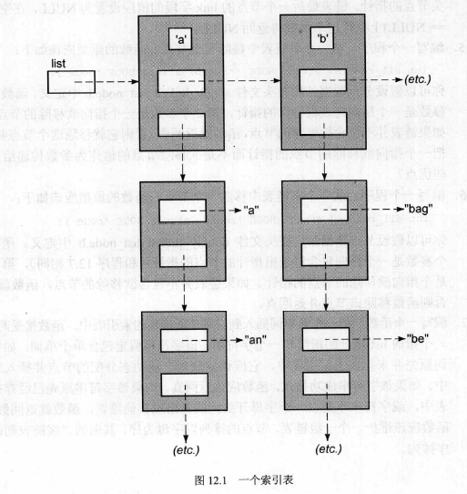

### chapter12 使用结构和指针

#### 单链表

如何将一个新节点插入到一个有序的单链表中？

首先看版本一的代码：

```c
#include<stdio.h>
#include<stdlib.h>
#include<string.h>

typedef struct node{
    int value;
    struct node *link;
}Node;

int sll_insert(Node *current, int new_value);

int sll_insert(Node *current; int new_value)
{
    Node *previous;
    Node *new_node;
    //首先寻找插入节点的位置
    while (current->value < new_value){
        previous = current;
        current = current->link;
    }
    //为新节点分配内存
    new_node = (Node*)malloc(sizeof(Node));
    if (new_node == NULL) return 0;
    //创建新节点成功将新值赋给new_node
    new_node->value = new_value;
    //将新节点插入链表中
    new_node->link = current;
    previous->link = new_node;
    return 1;
}

```

------

版本一的代码有一些缺陷在于，首先如果要插入的节点的数大于已有的所有节点的value时，需要插入到最后的位置上，但是版本一的代码中第一个while循环会出现对NULL指针的间接访问，程序会出错，因此在这个循环中需要加一个判断条件即current指针不为NULL，另外一个问题在于我们的版本一的代码无法访问到root指针的内容，所以当在头结点的需要插入一个新节点是无法进行操作的，因此我们需要将头结点的指针作为参数传入或者传入这个头结点的指针的指针（函数具有普适性）

版本二单链表的插入新节点

```c
#include<stdio.h>
#include<stdlib.h>
#include<string.h>

int sll_insert_2(Node **root, int new_value);

int sll_insert_2(Node **root, int new_value)
{
    Node *current = *root;
    Node *previous = NULL;
    Node *new_node;
    while (current != NULL && current->value < new_value){
        previous = current;
        current = current->link;
    }
    new_node = (Node*)malloc(sizeof(Node));
    if (new_node == NULL) return 0;
    new_node->value = new_value;
    new_node->link = current;
    //考虑插入的位置是头结点的时候
    if (previous == NULL){
        *root = new_node;
    }
    else{
        previous->link = new_node;
    }
    return 1;
}
```

版本二的代码完善了这两个问题，可以基本实现完整的需要进行新节点插入时的要求（在头节点位置或者尾节点位置均可以）。但是实际上这个代码还是可以继续优化的，下面给出版本三的代码：

版本三单链表插入新节点

```c 
#include<stdio.h>
#include<stdlib.h>
#include<string.h>

typedef struct node{
    int value;
    struct node *link;
}Node;

int sll_insert3(Node **rootp, int new_value);

int sll_insert3(Node **rootp, int new_value)
{
    Node *current;
    Node *new_node;
    while ((current = *rootp) !=NULL && current->value < new_value){
        rootp = &current->link;
    }
    new_node = (Node*)malloc(sizeof(Node));
    if (new_node == NULL) return 0;
    new_node->value = new_value;
    new_node->link = current;
    *rootp = new_node;
    return 1;
}
```

最终的版本通过一种更加一般的方式来进行新节点的插入，主要的问题在于，对于每一个在链表中的节点来说，我们在访问并插入新节点的时候，都是在对链表中的节点的link指针进行操作，而由于第一个节点的link指针是通过头指针去操作的，这个属于一种特殊的情况。考虑更想通过一种更加一般化的方式去访问每个节点的link指针，这里就构建了一个rootp指针，每一次在寻找插入位置的循环时都是将rootp节点指向当前节点的link指针，同时将current指针指向下一个节点，这样就可以省去使用previous指针。

-------

#### 双链表

基本的数据结构类型：

```c
struct Dnode{
    struct Dnode *fwd;
    struct Dnode *bwd;
    int value;
}Double_node;
```

双链表的构成方式：使用一个root节点，这个root节点的fwd指针指向的是第一个节点，bwd指针指向的是最后一个节点。

在双链表中进行插入节点的操作，一共会出现四种情况：

1. 新值插入的位置是链表的中间位置
2. 新值插入的位置是链表的起始位置
3. 新值插入的位置是链表的结束位置
4. 该链表为空，插入的新值是第一个节点

给出版本一的代码：

```c
#include<stdio.h>
#include<stdlib.h>
#include<string.h>

typedef struct DNODE{
    struct DNODE *fwd;
    struct DNODE *bwd;
    int value;
}Dnode;


int dll_insert(Dnode *rootp, int new_value);

int dll_insert(Dnode *rootp, int new_value)
{
    Dnode *current;
    Dnode *temp;
    Dnode *new_dnode;
    current = rootp->fwd;
    //首先需要检查这个new_value是否已经在双链表中
    //同时我们通过这个遍历循环寻找新值应该插入的位置
    //current指针指向的是新值节点插入的前一节点
    //temp指针指向的是新值节点插入的后一节点
    for (current=rootp; (temp = current->fwd) != NULL; current=temp){
        //如果new_value已经在这个双链表中则函数直接返回
        if (temp->value == new_value) return 0;
        if (temp->value > new_value) break;
    }
    new_dnode = (Dnode *)malloc(sizeof(Dnode));
    if (new_dnode == NULL) return 0;
    new_dnode->value = new_value;
    //下面开始讨论出现的四种情况下的哪一种
    if (temp!=NULL){
        if (current!=NULL){
            //这种是插入在中间的情况
            new_dnode->fwd = temp;
            new_dnode->bwd = current;
            current->fwd = new_dnode;
            temp->bwd = new_dnode;
        }
        else{
            //这种情况下是插入在第一个节点处
            new_dnode->fwd = temp;
            temp->bwd = new_dnode;
            rootp->fwd = new_dnode;
            new_dnode->bwd = NULL;
        }
    }
    else{
        if (current!=rootp){
            //这种情况是插入在结尾的位置上
            new_dnode->fwd = NULL;
            current->fwd = new_dnode;
            new_dnode->bwd = current;
            rootp->bwd = new_dnode;
        }
        else{
            //这种情况下这个链表实际上可以看做是一个空链表
            new_dnode->fwd = NULL;
            rootp->fwd = new_dnode;
            new_dnode->bwd = NULL;
            rootp->bwd = new_dnode;
        }
    }
    return 1;
}
```

使用了两个结构体指针：this和next，this指向的是插入新节点后前面一个节点，next指向的是插入新节点后的后面一个节点。首先使用for循环判断需要插入的值是否已经在链表中。下面对四种情况分别进行讨论，首先考虑插入的新节点不是链表的最后一个节点，这种情况又看是不是在头部插入；第二大类的情况是考虑插入的节点在链表的最后插入，同时的话还需要考虑是否为空链表的情况，实际上每一种情况下的思路都是类似的，只是一些细节上需要改进一下。

#### 课后习题

1. 改写程序12.3不使用current变量实现原函数的功能。

   ```c
   int sll_insert(register Node **linkp, int new_value)
   {
       register Node *new;
       while (*linkp != NULL && (*linkp)->value < new_value){
           linkp = &(*linkp)->link;
       }
       new = (Node *)malloc(sizeof(Node));
       if (new == NULL){
           return FALSE;
       }
       new->value = new_value;
       new->link = *linkp;
       *linkp = new;
       return TRUE;
   }
   ```

2. 讨论在单链表中使用“头结点”，这个哑节点始终是单链表的第一个元素，这就消除了插入链表起始位置的特殊情况，讨论这个技巧的利与弊。

   *如果考虑在程序12.3这种不用处理任何特殊情况下的代码，这种使用头节点的技巧没有任何的优越之处。反而在程序12.3这种情况下需要处理一些由于这个头结点带来的一些特殊情况：链表创建时需要特殊考虑头结点，其他对链表的操作需要跳过这个头结点，最后这个头结点还会浪费内存。*

3. 在程序12.3中插入函数会把重复的值插入到什么位置，如果将<改为<=会出现什么情况？

   *在程序12.3中会将重复的值插入在其他相同的值的前面；如果改为<=则会将新插入的重复的值插入在其他相同的值的后面。*

4. 讨论一些技巧，怎样省略双链表中的根节点的值字段。

   *如果根节点是动态分配的内存，我们可以通过只为节点分配一部分内存来达到目的。*

   `root = malloc(sizeof(Node) - sizeof(valuetype))`

   一种更加安全的方法是声明一个只包含指针的结构。

   ```c
   struct DLL_NODE;
   struct DLL_POINTERS{
       struct DLL_NODE *fwd;
       struct DLL_NODE *bwd;
   };
   struct DLL_NODE{
       struct DLL_POINTERS ppinters;
       int value;
   };
   ```

5. 如果程序12.7中对malloc的调用在函数的起始部分执行会有什么结果？

   *可能会导致内存泄露，即可能出现的情况是为新节点分配了内存但是却没有被加入到链表中。*

6. 能不能对一个无序的单链表进行排序？

   *可以，但是效率很低。更加好的一种策略是将所有的节点从链表中取出再重新将他们插入到一个新的有序的单链表中。*

7. 使用这种字母链表的数据结构，搜索一个特定的单词所花费的时间与使用一个存储所有单词的单链表相比，有没有什么变化？

   

   *在上图的这种多链表查找的方案下比在一个包含所有单词的链表中进行查找的效率要高得多。（显而易见hhh）*

